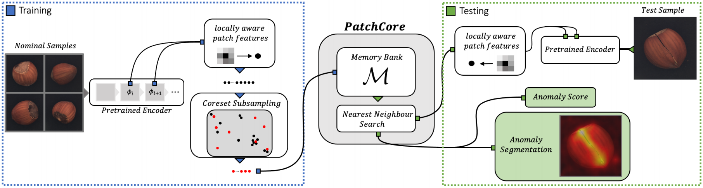

# PatchCore - Rewritten for Better Understanding

This repository is a more readable version of the [amazon's PatchCore implementation](https://github.com/amazon-science/patchcore-inspection).

Original Paper : Towards Total Recall in Industrial Anomaly Detection (Jun 2021) Roth et al. https://arxiv.org/abs/2106.08265.



## Usage

1. Clone this repository.

   ```shell
   git clone https://github.com/ToryXie/PatchCore.git
   ```

2. Synchronize the environment.

   ```shell
   uv sync
   ```

3. Modify the `src/config.yaml` file.

   Before training the model, make sure to modify the `config.yaml` file with your desired parameters. 

   ```yaml
   model:
     # Backbone networks for feature extraction.
     backbones:
       # WiderResNet with 50 layers, using layer2 and layer3 for feature extraction.
       wideresnet50:
         - "layer2"
         - "layer3"
       wideresnet101:
          - "layer2"
          - "layer3"
       resnext101:
          - "layer2"
          - "layer3"
       densenet201:
          - "features.denseblock2"
          - "features.denseblock3"
     batch_size: 2
     resize: 256  # Resize the input image.
     image_size: 224  # Center crop the input image.
   # resize: 366
   # image_size: 320
     fp16: true  # Enable FP16 for inference (use half precision).
   
     # Use IVF or IndexFlatL2 for indexing.
     use_ivf:
       enable: true
       # nprobe_scale is used as a divisor in the formula:
       # nprobe = total_clusters // 39 // nprobe_scale
       # It controls the number of clusters to search during retrieval.
       nprobe_scale: 100
     embed_dim: 1024
     patch_size: 3
     gpu: 0
     num_workers: 8
     random_seed: 42
   
   # Datasets for training
   datasets:
     - "bottle"
   # - "grid"
   ```

4. Train & Evaluate.

   To train and evaluate the model, you can run the following commands:

   * **Train the model**

     ```shell
     uv run src/train.py
     ```

   * **Evaluate the model**

     ```shell
     sh evaluate.sh
     ```

     